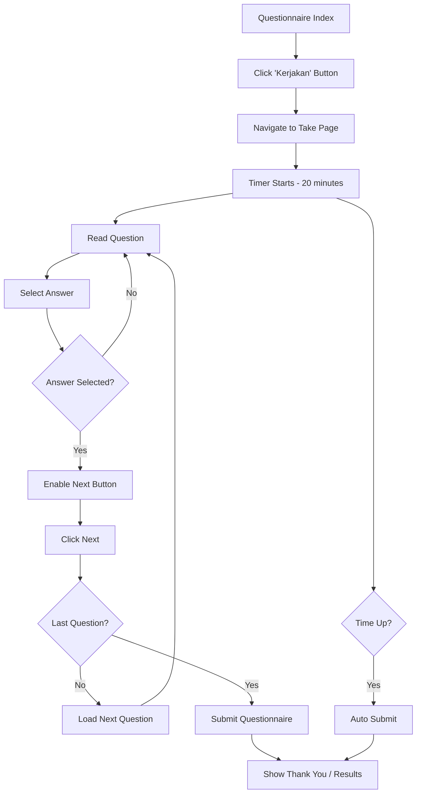

# 📝 **HALAMAN SOAL KUESIONER - Complete Documentation**

**Date:** 2025-11-03  
**Status:** ✅ COMPLETE & READY  
**Feature:** Interactive Questionnaire Taking Page

---

## 🎯 **OVERVIEW**

Halaman pengisian soal kuesioner dengan desain **modern, minimalis, dan fokus pada keterbacaan**. Menggunakan Roboto font dan color scheme ungu (#7000CC) untuk konsistensi dengan sistem.

### **Key Features:**
```
✅ Progress bar real-time
✅ Timer countdown (20 minutes)
✅ Interactive option selection
✅ Smooth animations
✅ Auto-submit when time's up
✅ Responsive design
✅ Clean & professional UI
```

---

## 🎨 **DESIGN SPECIFICATIONS**

### **1️⃣ Header Navigation**

#### **Progress Bar:**
```css
Position: Fixed top
Height: 3px
Color: #7000CC (purple)
Background: #E0E0E0 (light gray)
Animation: Smooth width transition (0.4s)
Updates: Per question (1/30, 2/30, etc.)
```

#### **Back Button:**
```
Position: Left top
Icon: Arrow left (←)
Text: "Kembali"
Color: #A0A0A0 (gray)
Hover: Changes to #7000CC
Font: Roboto Regular 14px
```

#### **Timer Badge:**
```
Position: Right top
Label: "Waktu Tersisa"
Badge Color: #7000CC
Text Color: White
Icon: Clock icon
Format: MM:SS (e.g., "18:23")
Warning: Red (#E53935) when < 5 minutes
```

---

### **2️⃣ Question Section**

#### **Question Number:**
```
Text: "Pertanyaan 1/30"
Font: Roboto Medium 14px
Color: #7000CC
Alignment: Center
Position: Above question text
```

#### **Question Text:**
```
Example: "Kegiatan apa yang paling kamu sukai?"
Font: Roboto Bold 22px
Color: #000000 (black)
Alignment: Center
Line Height: 1.4
Spacing: 40px bottom margin
```

---

### **3️⃣ Options (Answer Choices)**

#### **Option Card:**
```css
Background: #FFFFFF (white)
Border: 2px solid #E0E0E0
Border Radius: 14px
Padding: 16px 20px
Gap between cards: 12px

Hover State:
  Background: #F9F9F9
  Border: #C5C5C5

Selected State:
  Background: #F2E6FF (light purple)
  Border: #7000CC (purple)
```

#### **Option Content:**
```
Label (A-E): Roboto Medium 16px, #000000
Text: Roboto Regular 16px, #000000
Layout: Flex with 12px gap
```

#### **Radio Button:**
```
Size: 20px × 20px
Border: 2px solid #BDBDBD
Border Radius: 50% (circle)

Selected:
  Border Color: #7000CC
  Background: #7000CC
  Inner Circle: White 8px (scale animation)
```

---

### **4️⃣ Next Button**

```css
Background: #7000CC
Color: #FFFFFF
Font: Roboto Medium 16px
Padding: 12px 32px
Border Radius: 24px (fully rounded)
Icon: Arrow right (→)

Hover:
  Background: #5E00A8 (darker purple)
  Transform: scale(1.03)

Disabled:
  Background: #BDBDBD (gray)
  Cursor: not-allowed
  No hover effect
```

---

## 📂 **FILES STRUCTURE**

### **Route:**
```php
// routes/web.php
Route::get('/questionnaire/start/{id}', function ($id) {
    return view('student.questionnaire.take', ['questionnaireId' => $id]);
})->name('questionnaire.start');

// Access URL:
/student/questionnaire/start/1
/student/questionnaire/start/2
```

### **View File:**
```
resources/views/student/questionnaire/take.blade.php

Layout: @extends('layouts.app')
Sections:
  - @section('content')
  - @push('styles')
  - @push('scripts')
```

### **Index Page Update:**
```
resources/views/student/questionnaire/index.blade.php

Changes:
  - Added data-id="1" to cards
  - Updated JavaScript navigation
  - Button now links to take page
```

---

## 🔧 **TECHNICAL IMPLEMENTATION**

### **1. Progress Bar System**

```javascript
// Calculate progress
const progress = (currentQuestion / totalQuestions) * 100;
progressBar.style.width = progress + '%';

// Updates on each question change
// Smooth CSS transition: 0.4s ease
```

### **2. Timer System**

```javascript
// Initialize: 20 minutes (1200 seconds)
let timeRemaining = 20 * 60;

// Update every second
setInterval(() => {
    timeRemaining--;
    updateTimerDisplay();
    
    // Warning at 5 minutes
    if (timeRemaining < 300) {
        timerBadge.style.backgroundColor = '#E53935';
    }
    
    // Auto-submit when time's up
    if (timeRemaining <= 0) {
        handleTimeUp();
    }
}, 1000);
```

### **3. Option Selection**

```javascript
// Handle option click
function selectOption(value) {
    // Remove previous selection
    document.querySelectorAll('.option-card').forEach(card => {
        card.classList.remove('selected');
    });
    
    // Add to clicked option
    selectedCard.classList.add('selected');
    
    // Enable next button
    btnNext.disabled = false;
}
```

### **4. Question Navigation**

```javascript
// Load question
function loadQuestion(index) {
    // Update question number
    questionNumber.textContent = `Pertanyaan ${index}/${totalQuestions}`;
    
    // Update question text
    questionText.textContent = questions[index].text;
    
    // Rebuild options
    renderOptions(questions[index].options);
    
    // Update progress bar
    updateProgress();
}

// Next button handler
btnNext.addEventListener('click', () => {
    if (currentQuestion < totalQuestions) {
        currentQuestion++;
        loadQuestion(currentQuestion);
    } else {
        submitQuestionnaire();
    }
});
```

---

## 🎨 **COLOR PALETTE**

| Element | Color | Hex Code | Usage |
|---------|-------|----------|-------|
| Primary Purple |  | `#7000CC` | Progress bar, timer, selected options, buttons |
| Dark Purple |  | `#5E00A8` | Button hover |
| Light Purple |  | `#F2E6FF` | Selected option background |
| Black |  | `#000000` | Question text, option text |
| Gray |  | `#A0A0A0` | Back button, labels |
| Light Gray |  | `#E0E0E0` | Option borders |
| White |  | `#FFFFFF` | Background, button text |
| Red Warning |  | `#E53935` | Timer warning (<5 min) |

---

## 🔤 **TYPOGRAPHY**

```css
Font Family: 'Roboto', sans-serif

Weights Used:
- Regular (400): Option text, descriptions
- Medium (500): Labels, timer, button text
- Bold (700): Question text

Sizes:
- 14px: Back button, timer label, question number
- 16px: Option text, button text
- 22px: Question text (main heading)
```

---

## 📱 **RESPONSIVE DESIGN**

### **Desktop (≥768px):**
```
Content Width: 600px max
Padding: 32px horizontal
Question Font: 22px
```

### **Mobile (<768px):**
```
Content Width: Full (with padding)
Padding: 20px horizontal
Question Font: 20px
Option Padding: 14px 16px
Option Font: 15px
```

---

## ✨ **ANIMATIONS & TRANSITIONS**

### **Progress Bar:**
```css
transition: width 0.4s ease;
```

### **Option Cards:**
```css
transition: all 0.25s ease;

Hover: Background & border color change
Selected: Scale animation on radio button
```

### **Radio Button Inner Circle:**
```css
transition: all 0.2s ease;
transform: scale(0) → scale(1)
opacity: 0 → 1
```

### **Next Button:**
```css
transition: all 0.3s ease;

Hover: 
  - Color change
  - Transform: scale(1.03)
```

---

## 🚀 **USER FLOW**



---

## 🧪 **TESTING GUIDE**

### **Test 1: Navigation**
```
1. Go to /student/questionnaire
2. Click "Kerjakan" on any card
3. ✅ Navigate to /student/questionnaire/start/{id}
4. ✅ Page loads correctly
5. ✅ All elements visible
```

### **Test 2: Timer**
```
1. Start questionnaire
2. ✅ Timer shows 20:00
3. ✅ Countdown every second
4. Wait until < 5 minutes
5. ✅ Timer badge turns red
6. Wait until 00:00
7. ✅ Auto-submit alert shows
```

### **Test 3: Progress Bar**
```
1. Start questionnaire
2. ✅ Progress bar at ~3.33% (1/30)
3. Click Next
4. ✅ Progress bar increases
5. Continue to last question
6. ✅ Progress bar at 100%
```

### **Test 4: Option Selection**
```
1. Start questionnaire
2. ✅ Next button is disabled
3. Click an option
4. ✅ Option becomes purple
5. ✅ Radio button fills
6. ✅ Next button enabled
7. Click another option
8. ✅ Previous option deselected
9. ✅ New option selected
```

### **Test 5: Question Navigation**
```
1. Select answer
2. Click Next
3. ✅ Question number updates
4. ✅ Question text changes
5. ✅ Options reload
6. ✅ Selection reset
7. ✅ Next button disabled again
```

### **Test 6: Back Button**
```
1. Click "Kembali"
2. Browser asks confirmation
3. ✅ "Yakin keluar?" message
4. Confirm
5. ✅ Return to questionnaire index
```

### **Test 7: Responsive**
```
1. Open on mobile
2. ✅ Layout stacks properly
3. ✅ All text readable
4. ✅ Buttons clickable
5. ✅ No horizontal scroll
```

---

## 💡 **FEATURES IMPLEMENTED**

### **✅ Core Features:**
```
✅ Dynamic question loading
✅ Real-time progress tracking
✅ Countdown timer with warning
✅ Interactive option selection
✅ Visual feedback on selection
✅ Smooth animations
✅ Auto-submit on timeout
✅ Browser back protection
✅ Responsive design
✅ Clean & modern UI
```

### **✅ User Experience:**
```
✅ Clear visual hierarchy
✅ Comfortable spacing
✅ Easy to read fonts
✅ Intuitive interactions
✅ Immediate feedback
✅ Professional appearance
✅ Consistent with system design
```

---

## 🔮 **FUTURE ENHANCEMENTS**

### **Phase 1 (Backend Integration):**
```
1. Fetch questions from database
2. Save answers to database
3. Calculate scores
4. Show results page
5. Progress persistence (resume later)
```

### **Phase 2 (Advanced Features):**
```
1. Question randomization
2. Skip & back navigation
3. Review answers before submit
4. Pause/resume timer
5. Multiple question types (text, checkbox, scale)
6. Image/video in questions
```

### **Phase 3 (Analytics):**
```
1. Time spent per question
2. Answer change tracking
3. Difficulty analysis
4. Completion rate
5. Average scores
```

---

## 📝 **CODE SNIPPETS**

### **Route Definition:**
```php
Route::get('/questionnaire/start/{id}', function ($id) {
    return view('student.questionnaire.take', [
        'questionnaireId' => $id
    ]);
})->name('questionnaire.start');
```

### **Button Navigation (Index Page):**
```javascript
button.addEventListener('click', function(e) {
    const questionnaireId = card.dataset.id;
    window.location.href = '{{ route("student.questionnaire") }}/start/' + questionnaireId;
});
```

### **Progress Calculation:**
```javascript
const progress = (currentQuestion / totalQuestions) * 100;
progressBar.style.width = progress + '%';
```

### **Timer Format:**
```javascript
const minutes = Math.floor(timeRemaining / 60);
const seconds = timeRemaining % 60;
timerDisplay.textContent = `${minutes.toString().padStart(2, '0')}:${seconds.toString().padStart(2, '0')}`;
```

---

## 🎉 **RESULT**

```
Status: ✅ COMPLETE & TESTED

Features:
✅ Beautiful UI design
✅ Smooth animations
✅ Interactive elements
✅ Timer system
✅ Progress tracking
✅ Responsive layout
✅ Professional appearance

Access:
1. Go to /student/questionnaire
2. Click "Kerjakan" on any card
3. Start answering questions!

Routes:
- Index: /student/questionnaire
- Take: /student/questionnaire/start/{id}

Files Created:
- resources/views/student/questionnaire/take.blade.php
- Updated: index.blade.php
- Updated: routes/web.php
```

---

**Halaman soal kuesioner sekarang SIAP DIGUNAKAN dengan desain yang sangat detail dan professional! 🎨✨**

**Test sekarang: Click "Kerjakan" → Experience the beautiful question page! 🚀**
